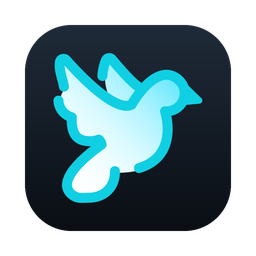
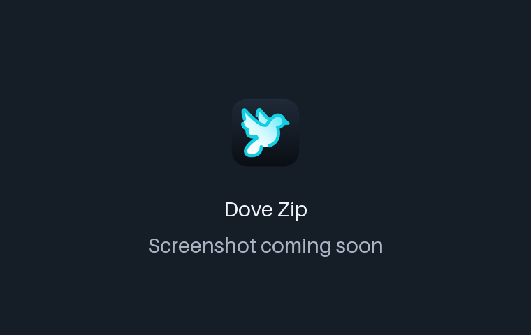
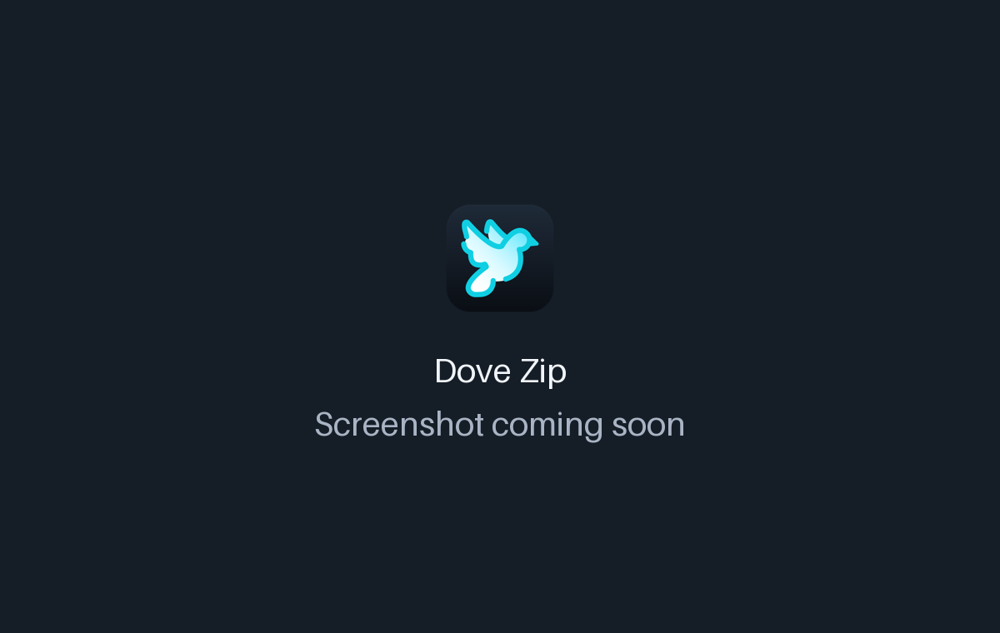
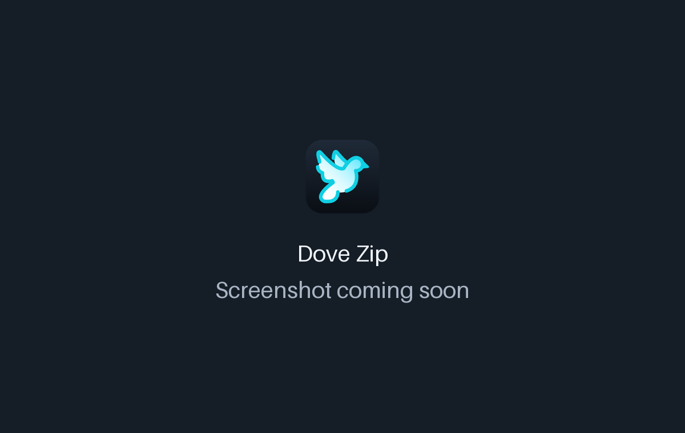

<!-- From jejezz/application-release-templates common/tool/readme @ conventions-v1.
     Structure and rules: conventions/readme-guide.md. Keep README.ko.md in sync.
     Check: python3 tool/readme/check_readme.py -->

<p align="center">
  
</p>

<h1 align="center">Dove Zip</h1>

<p align="center">
  A free, <b>ad-free archive utility for macOS, Windows and Linux</b> — browse ZIP, 7Z, RAR and TAR archives
  without extracting them, then extract or create them exactly the way you want.
</p>

<p align="center">
  <a href="https://github.com/jejezz/dove-zip-flutter/releases/latest"></a>
  <a href="https://github.com/jejezz/dove-zip-flutter/releases"></a>
  
  
  <a href="LICENSE"></a>
</p>

<p align="center">
  <b>English</b> · <a href="README.ko.md">한국어</a>
</p>

<p align="center">
  
</p>

## Features

- **Browse without extracting** — read the entry list, preview text and images with a double-click, and
  drill into archives nested inside archives, any number of levels deep
- **Three extract modes** — *here*, *smart* (a new folder named after the archive, never a folder inside
  a folder of the same name) and *choose location*; it remembers the last one. Extract only the items you
  select (⌘/Ctrl- and Shift-click)
- **Damaged archives, partially** — an unreadable entry doesn't stop the rest; skipped entries are listed
  and can be copied
- **Create archives** — compression level (store / fast / normal / max) with the estimated size before and
  the ratio after, extension filters, symlink handling, **AES-256 passwords** for ZIP and 7Z, and split
  volumes (`name.zip.001`, `.002`, … — Dove Zip's own scheme)
- **Drag in, drag out** — drop files to open or compress them; drag entries out to Finder or Explorer to
  extract them right there. On macOS, Finder's Services menu adds *Compress here* / *Extract here*
- **Light & dark, English & 한국어** — follows the system, or pick one in the toolbar

<p align="center">
  
  
</p>

### Supported formats

| Format | Extract | Create |
|---|---|---|
| ZIP | ✅ | ✅ (with password) |
| TAR, TAR.GZ/TGZ, TAR.BZ2/TBZ2, TAR.XZ | ✅ | ✅ |
| GZIP, BZIP2, XZ (single file) | ✅ | ✅ |
| 7Z | ✅ | ✅ (with password) |
| RAR (all of RAR5, most of RAR4) | ✅ | ❌ (not licensable — an industry-wide limit) |
| ZSTD, TAR.ZST | ❌ later | ❌ later |

Why each format is where it is: [`PLAN.md`](PLAN.md) §3.

## Install

Download from [**Releases**](https://github.com/jejezz/dove-zip-flutter/releases/latest):

| OS | File |
|---|---|
| macOS 12.0+ | `DoveZip-<version>-macos-universal.dmg` — open it and drag Dove Zip to Applications |
| Windows 10/11 (x64) | `DoveZip-<version>-windows-x64-setup.exe` |
| Linux (x64) | `DoveZip-<version>-linux-x64.tar.gz` — extract and run `./install.sh` (`--remove` to uninstall) |

**Windows:** the installer isn't code-signed yet, so SmartScreen says "Windows protected your PC" — choose **More info → Run anyway**.

## How it works

Every format is handled in pure Dart — [`archive`](https://pub.dev/packages/archive) for ZIP and the TAR
family, [`koni_sevenz` / `koni_rar`](https://github.com/zenbaku/koni_archive) (MIT) for 7Z and RAR — so
there is no native archiver to bundle or keep in sync across three operating systems. Formats that need a
native backend (ZSTD, LZ4, ISO, CAB) are deliberately left for a later version ([`PLAN.md`](PLAN.md) §4).
Dragging entries out uses [`flutter_drag_out`](https://github.com/jejezz/flutter_drag_out): on macOS the
file is extracted only once you drop it, so there is no size limit; Windows and Linux extract up front,
for entries up to 512 MB.

## Development

```bash
flutter pub get
flutter run -d macos     # or windows, linux
flutter test
```

Design and background: [`ARCHITECTURE.md`](ARCHITECTURE.md) (layers, domain model, backends, what changed
during implementation), [`UI_UX.md`](UI_UX.md) (screens, components, theme), [`PLAN.md`](PLAN.md)
(features, format matrix, priorities — the source of truth for what's done and what's deferred).
Built with Flutter and Riverpod; strings are ARB files under `lib/l10n/` (`gen-l10n`).

Releasing: `scripts/bump-version.sh patch`, merge, then tag `vX.Y.Z` — CI builds, signs and publishes every
platform. Details: [`docs/RELEASE.md`](docs/RELEASE.md). Rules: [application-release-templates/conventions](https://github.com/jejezz/application-release-templates/tree/main/conventions).

## Credits

- Font: [SeoulNamsan](https://www.seoul.go.kr/seoul/font.do) (Seoul Metropolitan Government, KOGL Type 1)
- Icons: [Icons8](https://icons8.com)
- 7Z/RAR decoding: [koni_archive](https://github.com/zenbaku/koni_archive) (MIT)

## License

[MIT](LICENSE) © 2026 Jongyun Ahn
